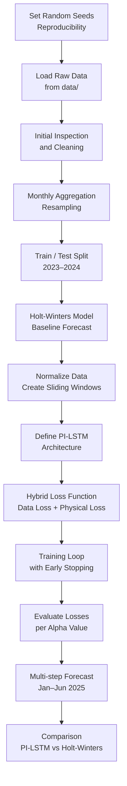

# PI-LSTM + Holt-Winters Forecasting Pipeline

## Overview
This repository implements a **Physics-Informed LSTM (PI-LSTM)** model combined with a **Holt–Winters exponential smoothing model** to perform time-series forecasting. The approach integrates **data-driven learning** with **physical/structural constraints** derived from classical statistical forecasting, improving robustness and interpretability.

The notebook reproduces the full experimental pipeline used for training on historical data (2023–2024) and generating **multi-step forecasts for 2025**.

---

## Repository Structure

```text
.
├── data/                 # Input datasets (CSV or equivalent time-series files)
├── pi-lstm.ipynb         # Main notebook with the full experimental pipeline
├── requirements.txt     # Python dependencies
└── README.md             # Project documentation (this file)
```

> **Important**
> - All datasets must be placed inside the `data/` directory.
> - The notebook and `requirements.txt` are assumed to be located at the project root.

---

## Methodology Summary

The pipeline follows a **hybrid modeling strategy**:

- **Holt–Winters model** acts as:
  - A baseline statistical forecasting model
  - A source of *physical guidance* (inductive bias)
- **PI-LSTM neural network**:
  - Learns residual patterns from data
  - Is constrained by a hybrid loss function that balances:
    - Data-driven loss
    - Physics-based (Holt–Winters) loss

---

## Step-by-Step Workflow



---

## Installation

```bash
pip install -r requirements.txt
```

Python version >= 3.9 is recommended.

---

## How to Run

1. Place your dataset(s) inside the `data/` directory.
2. Open the notebook:
```bash
jupyter notebook pi-lstm.ipynb
```
3. Run all cells sequentially.

---

## Outputs

- Training and validation loss curves
- Holt–Winters baseline forecasts
- PI-LSTM multi-step forecasts
- Comparative visualizations

---

## License

Research and educational use.
